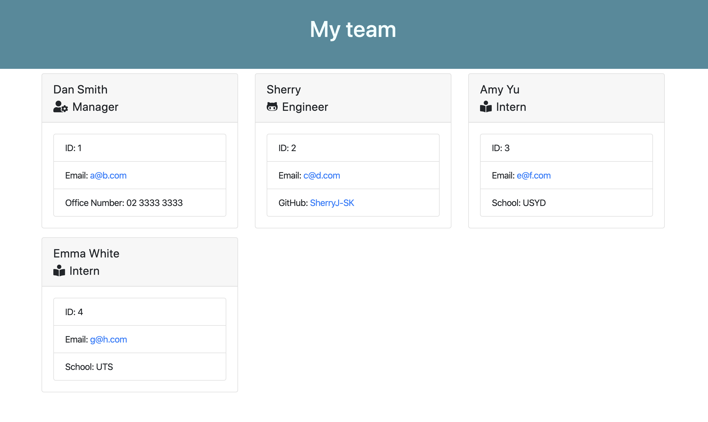

# Employee Summary

## Description
This command-line application was designed to assist employer to created a HTML to displays summaries for each person. This application allow user/employer input a team of employees, which include managers, engineers and interns.

## Getting Started
### Installing
Before running the command-line application, the package.json need to be installed
```sh
npm install
```

## Running test
To generate the HTML, user/employer can enter the command in the terminal
```sh
node index.js
```
### Questions included
There are few information required for each employee
* Name
* ID
* Email

Different type of employee has unique questions:

**Manager**
* Office Number
**Engineer**
* GitHub username
**Intern**
* School

## HTML sample display


## Acknowledgments
1. Node js
   - class
   - inquire
   - fs
2. CSS framework
   - CSS style sheet
   - Bootstrap
